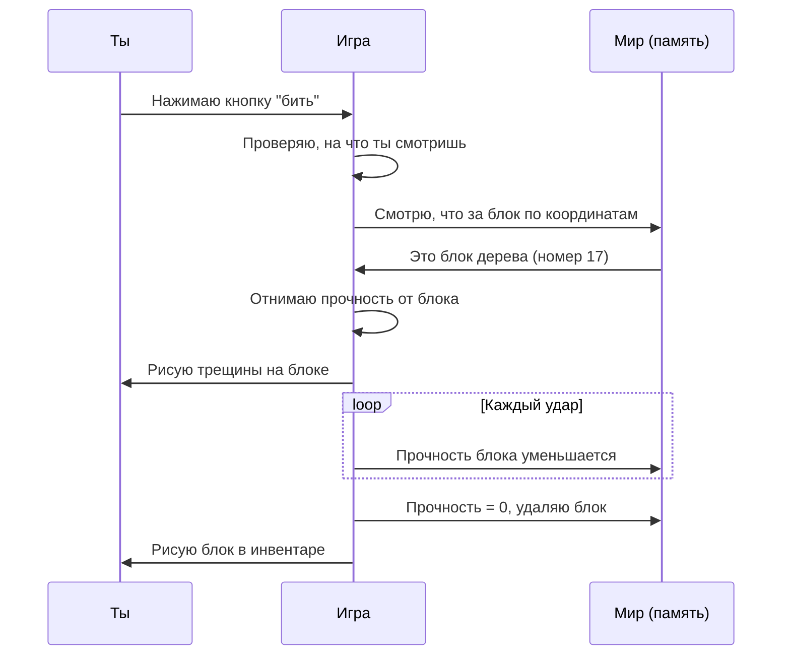
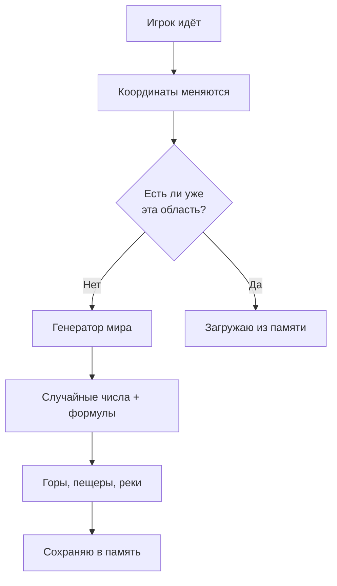
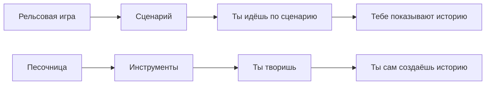

## Бесконечные миры «песочницы»

Почему в Minecraft и GTA можно делать всё что угодно и как это работает

---

Представь, что тебе дали огромный ящик с кубиками LEGO. Никаких инструкций. Никаких картинок на коробке. Просто куча деталей и полная свобода: хочешь — строй замок, хочешь — машину, хочешь — разломай всё и сделай заново.

А теперь представь, что этот ящик бесконечный. И внутри него — целый мир с горами, реками, деревнями и секретами. И ты можешь делать там **абсолютно всё**.

Это и есть игры-песочницы. Самые известные — **Minecraft** и **GTA**. Давай разберёмся, как они устроены и почему там можно делать всё что угодно.

---

### 🏗️ Что такое «песочница»?

В играх есть два подхода:

| Подход | Как работает | Пример |
|--------|--------------|--------|
| **Рельсы** | Игрок идёт по сюжету как по рельсам: туда — задание, туда — следующий уровень | Старые игры, квесты |
| **Песочница** | Тебя кидают в мир и говорят: «Делай что хочешь, мы всё позволим» | Minecraft, GTA, Roblox |

**Песочница (sandbox)** — это игра, где главное — свобода. Нет жёсткого сценария. Ты сам решаешь, чем заниматься:

- Строить
- Исследовать
- Сражаться
- Творить
- Бездельничать
- Ломать
- Придумывать свои правила

Всё возможно.

---

### ⛏️ Minecraft: мир из кубиков

Minecraft — самая продаваемая игра в истории. Продано больше **300 миллионов копий**! Почему? Потому что это бесконечный конструктор.

**Как устроен мир Minecraft**

```
      ╱╲
     ╱  ╲
    ╱    ╲
   ▕ БИОМЫ ▏
   ▕       ▏
   ▕  🌍   ▏
    ╲    ╱
     ╲  ╱
      ╲╱
```

Мир Minecraft состоит из **кубиков (блоков)**. Каждый блок — это 1×1×1 метр в игровом мире.

Виды блоков:
- 🟫 Земля
- 🟩 Трава
- 🪨 Камень
- 🪵 Древесина
- 💧 Вода
- 🔥 Лава
- 💎 Алмазная руда
- И ещё 800+ видов!

**Главный секрет:** каждый блок — это просто число в памяти компьютера. Номер блока означает, что это: 1 = камень, 2 = трава, 3 = земля и так далее.

Весь мир — это гигантская табличка с числами:

```
Место (x, y, z)    Что там
(0,0,0)           1 (камень)
(1,0,0)           1 (камень)
(2,0,0)           1 (камень)
(3,0,0)           2 (трава)
(4,0,0)           3 (земля)
...               ...
```

---

### 🧩 Как Minecraft понимает, что ты сломал блок?

Допустим, ты подходишь к дереву и начинаешь его рубить. Что происходит внутри компьютера?



Всё просто! Игра просто меняет число в памяти с 17 (дерево) на 0 (воздух). А потом рисует тебе блок в руке.

---

### 🌍 Бесконечный мир? Как такое возможно?

Ты наверняка замечал, что в Minecraft можно идти в любую сторону часами, и мир не заканчивается. Но компьютер не может хранить в памяти бесконечный мир — памяти не хватит.

**Хитрость:** мир создаётся **на лету**, когда ты к нему приближаешься.



**Генератор мира** — это математическая формула, которая по координатам (x, y, z) решает, какой там блок. Она использует случайные числа, но так хитро, что получаются горы, пещеры и океаны.

Если ввести те же числа (сид мира) — получится тот же самый мир. Поэтому друзья могут ввести твой сид и оказаться в точно таком же мире, как у тебя!

---

### 🏙️ GTA: город-аквариум

Grand Theft Auto (GTA) — другая песочница. Там мир не из кубиков, а почти как настоящий город.

**Как устроен город в GTA**

```
    ┌──────┬──────┬──────┐
    │ Дом  │Дорога│ Дом  │
    ├──────┼──────┼──────┤
    │Дорога│Парк  │Дорога│
    ├──────┼──────┼──────┤
    │Магаз │Дорога│Заправ│
    └──────┴──────┴──────┘
```

Весь город разбит на **секторы** (тайлы). Когда ты в одном секторе, компьютер держит в памяти его и соседние. Остальные сектора «спят».

**Что происходит, когда ты идёшь по городу:**

1. Ты заходишь в новый район
2. Компьютер загружает его с диска в память
3. Появляются дома, машины, люди
4. Район, из которого ты ушёл, выгружается из памяти

Это как если бы за тобой ходила съёмочная группа и строила город прямо перед тобой, а позади тебя всё разбирала.

---

### 🤖 Жизнь в городе: как работают NPC

NPC (Non-Player Character) — это люди, которыми не управляет игрок. В GTA их тысячи: прохожие, водители, полицейские.

**Как они думают?**

У каждого NPC есть простой алгоритм:

```
┌─────────────────┐
│   НАЧАЛО        │
└─────────────────┘
         │
         ▼
┌─────────────────┐
│   ИДТИ ВПЕРЁД    │
└─────────────────┘
         │
         ▼
┌─────────────────┐
│  ПЕРЕДО МНОЙ    │ ◄──┐
│    ПРЕПЯТСТВИЕ? │    │
└─────────────────┘    │
         │             │
    Да   │   Нет       │
         ▼             │
┌─────────────────┐    │
│  ОБОЙТИ ИЛИ     │    │
│  ПОВЕРНУТЬ      │    │
└─────────────────┘    │
         │             │
         └─────────────┘
```

Они просто идут вперёд, обходят препятствия и реагируют на игрока. Если игрок начинает стрелять — включается другой алгоритм: «БЕЖАТЬ И КРИЧАТЬ».

Водители машин тоже следуют простым правилам:

- Если впереди машина — тормози
- Если зелёный свет — едь
- Если красный — стой
- Если игрок выбежал на дорогу — жми по тормозам (или сбивай, зависит от наcтроек)

---

### 🎯 Почему в песочницах можно делать ВСЁ?

На самом деле нельзя делать ВСЁ. Нельзя, например, купить билет на Луну в GTA или вырастить дракона в Minecraft (без модов). Но кажется, что можно всё, потому что **игра реагирует на твои действия миллионом способов**.

**Главный секрет:** комбинаторика.

Допустим, в игре есть 100 предметов и 100 действий. Это даёт 100 × 100 = 10 000 комбинаций. А если предметы можно ставить друг на друга — комбинаций становится бесконечно много.

В Minecraft особенно:
- Воду можно смешивать с лавой → получается камень или обсидиан
- Красную пыль можно соединять с повторителями → получаются сложные схемы
- Поршни могут двигать блоки → строятся механизмы
- Вагоны ездят по рельсам → целые транспортные системы

Из простых кирпичиков собираются невероятные вещи. Люди строят в Minecraft:
- Действующие калькуляторы
- Города с населением
- Точные копии замков из фильмов
- Музыкальные инструменты
- Даже целые компьютеры внутри игры!

---

### 🧠 Как игра запоминает, что ты натворил?

Представь, что ты построил огромный замок в Minecraft, сохранил игру, выключил компьютер. А через месяц включил — замок на месте! Как?


graph TD
    A[Ты строишь] --> B[Игра записывает:]
    B --> C[Блок 1 стоит в (10,20,30)]
    B --> D[Блок 2 стоит в (11,20,30)]
    B --> E[... ещё миллион блоков ...]
    
    F[Сохраняю игру] --> G[Все координаты<br/>записываются на диск]
    G --> H[Файл сохранения весит<br/>мегабайты или гигабайты]
    
    I[Включаешь игру] --> J[Читаю файл сохранения]
    J --> K[Расставляю блоки по местам]
    K --> L[Твой замок снова тут!]


**Сколько весит мир Minecraft?**

| Что сохраняется | Примерно размер |
|-----------------|-----------------|
| Пустой мир | 1-10 МБ |
| Небольшая постройка | 10-50 МБ |
| Огромный город с механизмами | 100-500 МБ |
| Карта, где всё застроено | Несколько ГБ |

То есть целый мир помещается на маленькую флешку!

---

### 🌟 Другие песочницы

Не только Minecraft и GTA дают свободу. Вот ещё примеры:

| Игра | В чём свобода |
|------|---------------|
| **Roblox** | Можно не только играть, но и создавать свои игры внутри игры |
| **Terraria** | 2D-песочница с миллионом монстров и предметов |
| **The Sims** | Строй дом и управляй жизнью человечков |
| **Breath of the Wild** | Можно идти куда хочешь, решать задачи как хочешь |
| **Garry's Mod** | Вообще без правил — просто физическая песочница |
| **No Man's Sky** | 18 квинтиллионов планет для исследования |

---

### 🎮 Почему в песочницы интересно играть?

Психологи говорят, что игры-песочницы включают **творческую часть мозга**. Это как рисование или лепка из пластилина, только в цифре.

| Что даёт песочница | Почему это круто |
|--------------------|------------------|
| **Свобода** | Нет начальника, который говорит, что делать |
| **Творчество** | Можно построить то, что в голове |
| **Исследование** | Всегда есть новый уголок |
| **Истории** | Ты сам придумываешь приключения |
| **Друзья** | Вместе строить веселее |

В песочнице нет «правильной» игры. Можно просто копать тоннели, можно строить замки, можно разводить коров, можно сражаться с драконами. Или всё сразу.

---

### 🤯 Безумные факты о песочницах

> 🌌 **В Minecraft мир больше, чем поверхность Земли**. Диаметр мира — 60 миллионов блоков. Чтобы дойти до края, нужно идти 820 часов (месяц без остановки)!

> 💰 **В GTA V целая экономика**. Игроки могут покупать дома, бизнесы и акции. Цены на акции меняются от действий игрока.

> 🏰 **Люди строят целые страны**. Некоторые фанаты воссоздают в Minecraft целые города — Нью-Йорк, Москву, Париж. С точностью до здания.

> 🎵 **Музыка из блоков**. В Minecraft можно делать музыкальные проигрыватели, которые играют мелодии. Люди переиграли целые симфонии!

> 🚗 **В GTA можно просто ездить по правилам**. Некоторые игроки не проходят сюжет, а просто ездят как обычные водители и наслаждаются городом.

---

### 🏁 Главный секрет песочниц

В рельсовых играх разработчики придумывают за тебя, что будет интересно. В песочницах они дают тебе инструменты, а интересное придумываешь **ты сам**.



Minecraft не говорит тебе: «Иди убей дракона». Он говорит: «Вот мир. Вот кирка. Разбирайся сам». И в этом магия.

---

